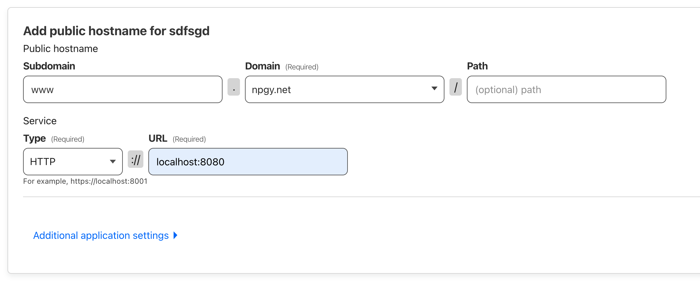
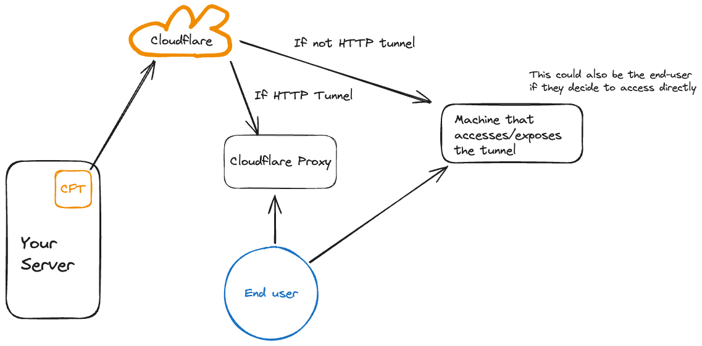
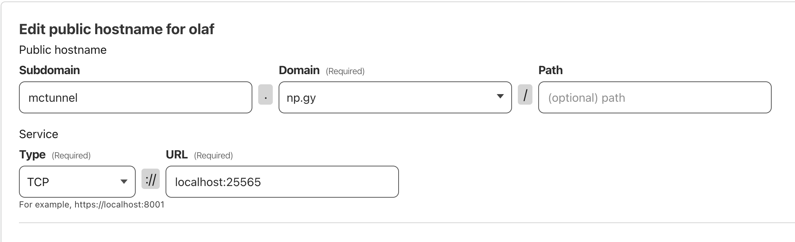
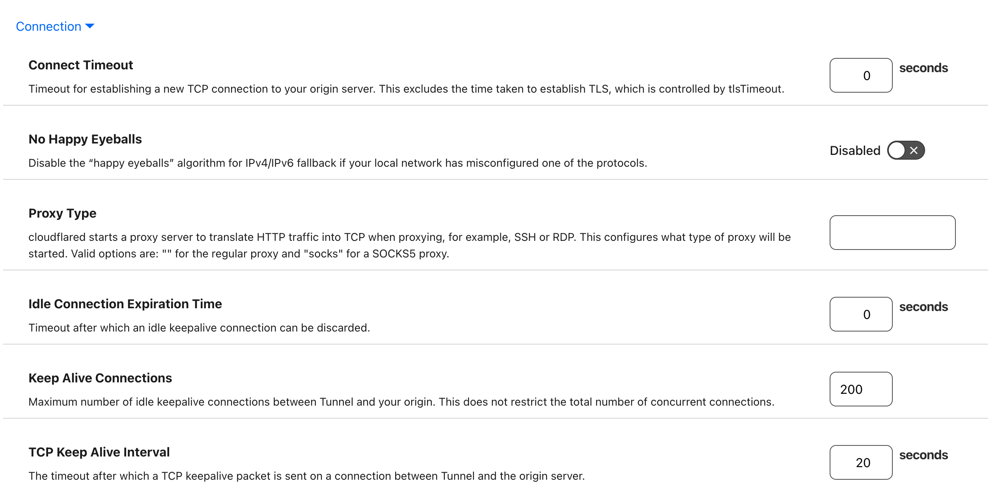

## Who This Guide is For

- You own a homelab or home server
- You want to host services without port forwarding
- You want DDoS protection / don't want to expose your public IP when hosting services

## Getting Started

Let's take care of the low hanging fruit and set up a simple tunnel running on your machine.  
First, sign into [Cloudflare](https://dash.cloudflare.com/login). If you don't already have an account then create one, it's free!

You will also need a **domain name** connected to your Cloudflare account for this to work, so make sure you have one and if not, go grab one, they usually don't cost more than 10-20 dollars per year. You can either purchase a domain from Cloudflare, or if you have one from another registry, here's the guide on how to connect it to your Cloudflare account: [https://www.youtube.com/watch?v=7hY3gp\_-9EU](https://www.youtube.com/watch?v=7hY3gp_-9EU)

### Once signed in...

Navigate to **Zero Trust** in your left sidebar.
If this is your first time in Zero Trust, you'll have to initially sign up for it. This is also free, however requires a credit/debit card to get set up.  
Click on **Networks > Tunnels** in the left sidebar. Click **Create a tunnel**. Select Cloudflared as the connector, and then give your tunnel a name.

Now you will install the connector on your system. Do this on the system you wish to host services from. Select your host system's OS. Follow the steps to install the connector.

Now we can add a public hostname to start:

Above is an example of a public hostname that will allow me to serve HTTP traffic from an HTTP server running on port 8080 on my host server locally.  
I have it pointing to a domain, **www\.npgy.net**.
Cloudflare will automatically proxy the traffic from the tunnel and expose my locally running web server for me at that address.

### Let's get something straight

Cloudflare tunnels on their own do not expose your services as they are to the internet. The exposing of your service happens wherever the tunnel is accessed by a client.  
There's a couple ways this can happen. With HTTP tunnels, Cloudflare handles the proxying for you headache-free. But if you want to host a game server for example, you'll need some other machine to access and expose the tunnel to the end user. The end user could also connect to your tunnel directly if they wanted, although this is more cumbersome, and we want to make it easy for the user don't we?

Enough of the chit chat. Let's get down to business.

## Hosting a game server over a tunnel

Let's create another public hostname on your tunnel, this time for Minecraft!  
Below are the specific settings I use. Some additional tweaks are there to help get rid of timeouts.  
(P.S. I don't know if my timeouts happened due to these settings or if it was from allowing ICMP packets thru the firewall on my EC2 instance, so take this with a grain of salt)

Next, we need a way to proxy this tunnel so your friends can connect without needing to use the `cloudflared` command line tool.  
You're free to use whatever cloud box you want. I am using AWS EC2, which costs me about $2.50 USD per month to host a plethora of tunneled services.

Here are the general steps you need to take to set up your cloud box to proxy your tunnel. The process is generally the same for other cloud computers / VPS but may vary slightly.

- Install [cloudflared](https://developers.cloudflare.com/cloudflare-one/connections/connect-networks/downloads/) on your cloud box
- Ideally, have the ability to spawn it as a background process. For example, by using `tmux`
- Execute this command to connect to and expose the tunnel  
  `cloudflared access tcp --hostname mctunnel.np.gy --url 0.0.0.0:25565`
- Then you'll need to open the same port **25565** in your cloud box's firewall
- After all this, you should be able to connect to your server via your cloud box's public IP! You can create an A record so that you and your friends can connect via a nice domain, such as **mc.npgy.net** (this isn't a real server so don't get any ideas)

### Happy tunneling

